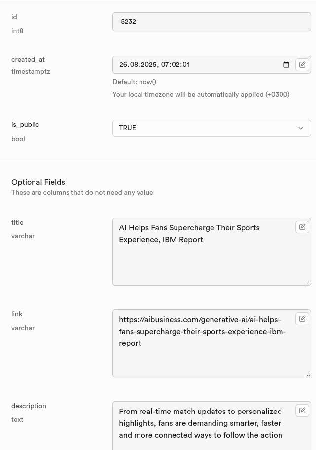
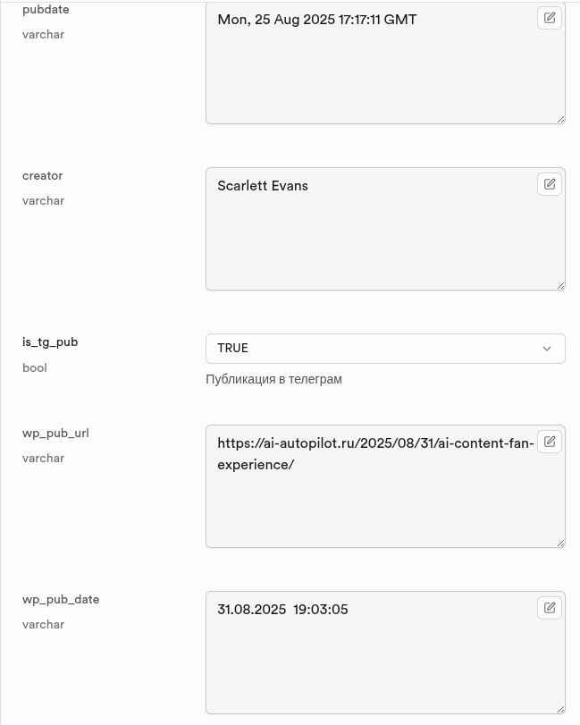
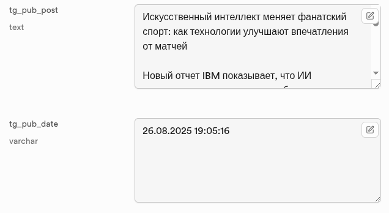
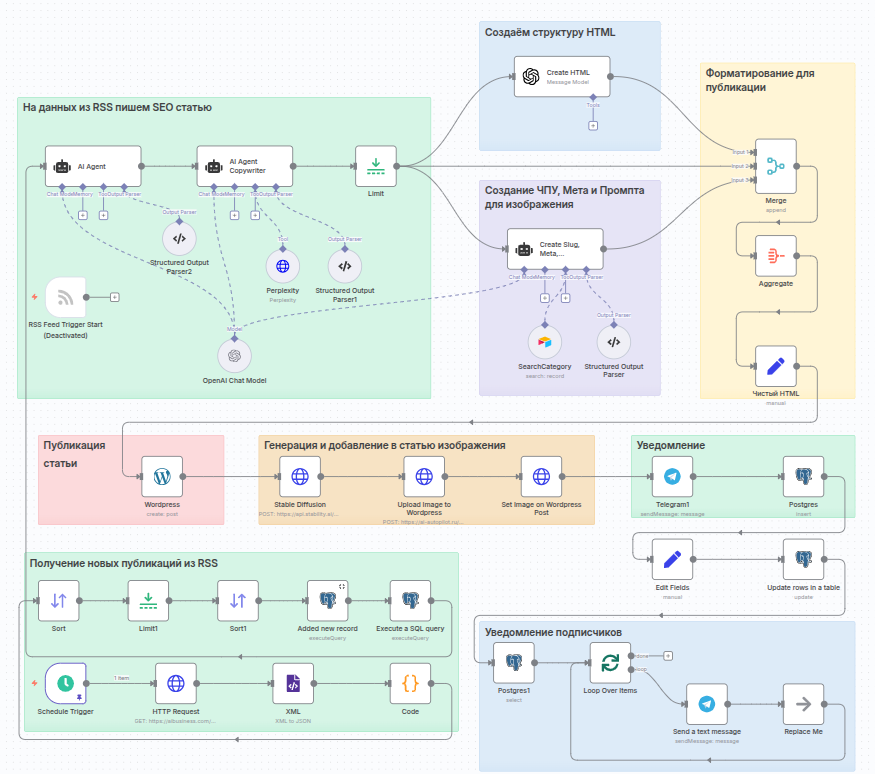
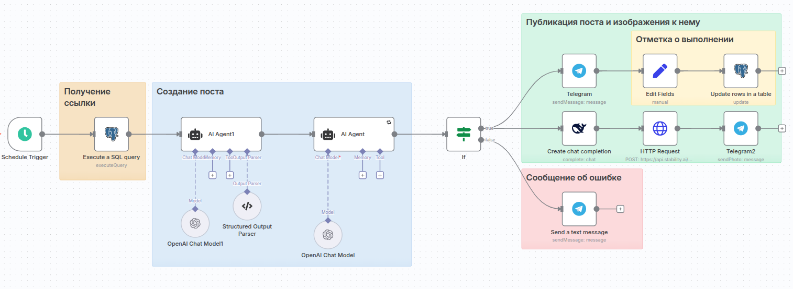
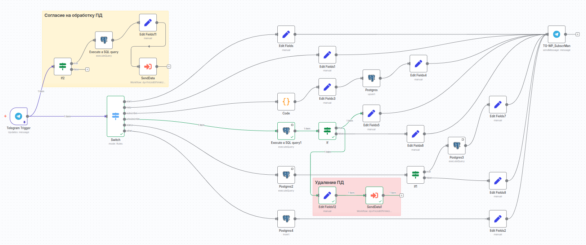
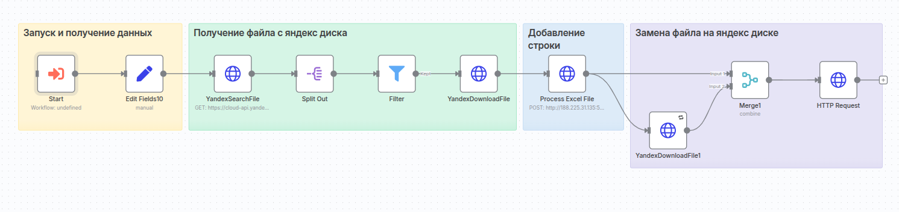

# Визуальная документация ContentFlow Factory

Данная папка содержит скриншоты и диаграммы, демонстрирующие работу системы ContentFlow Factory.

## 📊 Структура базы данных

### Таблица RSS (PostgreSQL)
Основная таблица для хранения информации о статьях из RSS-ленты:

`

**Структура отображает:**
- URL адреса исходных статей
- Заголовки и описания на английском языке
- Даты получения из RSS-ленты
- Статусы обработки и публикации
- Ссылки на опубликованные материалы
- Флаги для различных каналов публикации

## 🔄 Рабочие процессы (Workflows)

### 1. WordPress публикация

**Workflow-WP.png** — демонстрирует полный цикл обработки статьи для блога:
- Получение данных из RSS-ленты
- Сохранение в PostgreSQL
- Анализ и поиск дополнительной информации
- Рерайт и перевод на русский язык
- Генерация изображения
- Публикация в WordPress
- Обновление статуса в базе данных

### 2. Telegram публикация

**Workflow-TG.png** — показывает процесс создания постов для Telegram канала:
- Выборка неопубликованных тем из PostgreSQL
- Перевод и адаптация контента под формат поста
- Генерация изображения для социальных сетей
- Публикация в Telegram канале
- Логирование результатов

### 3. Система подписок

**Workflow-SubScr.png** — отображает работу с подписчиками:
- Переход с блога через баннер "Подписаться"
- Запуск Telegram-бота
- Оформление подписки с согласием на обработку ПД
- Управление подпиской (статус, отписка)
- Сохранение данных в PostgreSQL
- Уведомления о новых публикациях

### 4. Журналирование ПД

**Workflow-AddLine.png** — процесс ведения журнала персональных данных:
- Фиксация операций с ПД (подписка/отписка)
- Формирование записи для журнала
- Автоматическое добавление строки на Яндекс.Диск
- Обеспечение соответствия ФЗ-152

## 📋 Документация по персональным данным

### Журнал обработки ПД

**Журнал Обработки ПД.png** — пример ведения журнала обработки персональных данных:
- Дата и время операции
- Тип операции (подписка/отписка)
- Идентификатор пользователя
- Правовое основание обработки
- Цель обработки данных
- Соответствие требованиям ФЗ-152 "О персональных данных"

## 🔧 Техническая реализация

Все скриншоты демонстрируют реальную работу системы на российском VDS сервере с соблюдением требований к локализации данных и обработке персональной информации в соответствии с российским законодательством.

### Особенности архитектуры:
- **Отказоустойчивость**: система продолжает работу при недоступности отдельных источников
- **Масштабируемость**: легкое добавление новых RSS-источников
- **Соответствие законам**: полная интеграция с требованиями ФЗ-152
- **Мониторинг**: детальное логирование всех операций

---

*Все изображения представляют реальные интерфейсы и данные работающей системы ContentFlow Factory.*
